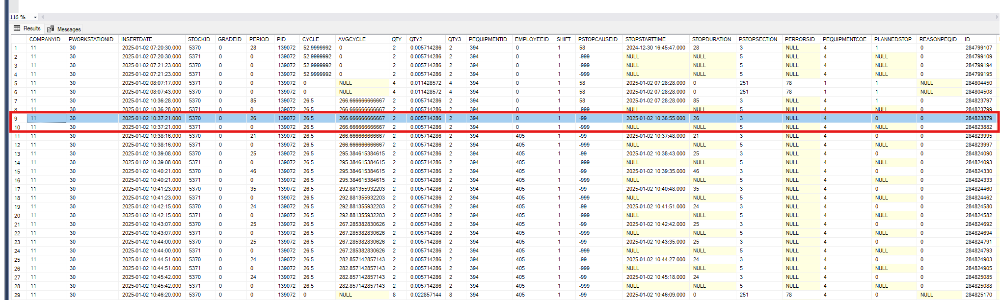

# Kritik feature olabilecek kolonlar
**PWORKSTATIONID**: İlgili iş istasyonu  
**INSERTDATE**: Kayıtın oluştuğu tarih  
**PERIOD**:    
**STOCKID**: Üretilen stok  
**PID**: Üretim planı  
**CYCLE**: Çevrim süresi  
**QTY**: Üretilen adet  
**PEQUIPMENTID**: Üretim yapılırken kullanılan ekipman  
**EMPLOYEEID**: Takım id bilgisi  
**SHIFT**: Vardiya  
**PSOPCAUSEID**: 999:Çalışıyor, -2:İş bekliyor, -99:Çokote(hız kaybı), 0:=tanımsız duruş  (-2 olduğunda PID=0 olmalı)  
**STOPSTARTTIME**: Duruş başlama zamanı  
**STOPDURATION**: Duruş süresi  
**PERRORSID**: Iskarta id bilgisi (her fire olduğunda kayıt atılır)  
**PEQUIPMENTCOE**: Üretim çarpanı. Bir kalıpta 10 göz olduğu durumda tek seferde 10 ürün çıkarabilir. Bu durumda ekipman kullanım sayısı x 10 işlemi bize toplam üretilen ürün miktarını verecektir. Ancak bu gözlerden bir tanesi arızalanırsa bu sefer çarpanımız 10 değil 9 olacaktır.    
**PLANNEDSTOP**: Eğer bir duruş başladıysa bu alan ilk önce 1 olarak güncellenir. Eğer planlanan süre aşıldıysa duruş artık plansız olur ve yeni satırda bu alana 0 yazılır.  
**REASONEQID**: Birbirini besleyen istasyonların olduğu bir sistem varsa, duruşa sebep olaran kök istasyonun id bilgisi burada tutulur. Örneğin PWORKSTATIONID 5 olabilir ancak bu istasyonun durmasına sebep olan istasyon id'si 3 ise 3 bilgisi bu alanda tutulur.  

## Potansiyel sorular ve cevapları

**•	Cycle nihai ürün çıkma süresi midir?**  
Bir ürünün üretilme süresidir. Planlanan süredir. Eğer bir istasyonda iki kişi çalışmaya başlarsa ya da üretim sırasında herhangi bir ekipman bile değişirse çevrim süresi anlık olarak değiştirilebilir. 

**•	QTY birden fazla ise cycle bilgisini nasıl bulabilirim?**   
Cycle bilgisi aslında bir ürünün üretilmesi için gereken süredir. Örneğin CYCLE=50sn, PERIOD=301sn, QTY ise 12 olsun. Bu şu şekilde okunur. Bu iş için çevrim süresi 50 sn olarak belirlenmiş ve bu şekilde 301 saniye geçirilmiştir. Geçirilen bu 301 sn içinde ise toplam 12 tane ürün üretilmiştir. 301 sn çevrim süresine bölünmez çünkü  geçirilen bu saniyenin her anında iş yapılmamış olabilir. 

**Ek Bilgi:** Birleştirilmiş iş emri açıldığında üretilen stoklardan sadece bir tanesi için zaman(period) bilgisi yazılır. Birleştirilmiş iş emrinde eş zamanlı olarak üretim yapılır. Bir arabanın sağ ve sol aynasının üretildiğini düşünelim. Bunların ikisinden de 26 saniye boyunca 2’şer tane üretilmiş olsun. Farklı ürün olduğu için dolayısı ile farklı stok id bilgisi olduğu için 2 kayıt atılır. Bu satırlardan birinde PERIOD bilgisi 0 girilir çünkü 26 saniyede eş zamanlı üretilen bu ürün için sanki ayrı ayrı zaman harcanıp toplam 52 sn de bu ürünler çıkarılmış gibi yorumlanmamalı.   

**•	Çokote bilgisini firmalar ne olarak değerlendiriyor ve nasıl aksiyon alıyorlar?**  
Çokote; firmaların anlık hız kaybı olarak değrrlendirdiği kısa süreli duruşlardır. Kaç saniye altındaki duruşların çokote olarak kabul edileceğini firmalar kendileri parametrik olarak belirlemektedir.  
Bir duruş çokote olarak değerlendirildiğinde bu duruşun süresi kullanıblabilirlik hesabında kullanılmıyor, bunun yerine performans hesaplamasında performans verisini düşürüyor.   
**Peki nasıl aksiyon alıyorlar?** Düşünülmesi gereken birkaç şey var: Biz çevrim süresini yanlış mı belirledik, veya makinede anlık duraklamalara sebep olabilecek bir sorun mu var soruları gündeme gelir

**•	Tanımsız duruşu nasıl değerlendiriliyorlar? İsteğe göre tanımsız duruşa geçilebilir mi?**  
Tanımsız duruşa sistem sadece kendisi geçer. Tanısmsız bir duruş müşteri için kaynağı belli olmayan bir duraklama süresidir bu yüzden operatörlerin belli periyotlarla ya da anlık olarak tanımsız duruşun asıl sebebini seçmeleri beklenir. Operatörün bu seçimi zorunluluk haline de getirilebilir.

**•	Çokoteden sonra neye göre sonraki duruş belirlenir?**  
Aslında çokote başlangıç anında bir tanımsız duruştur. Eğer duruş çokote limit süresinin altında bir sürede tamamlanıp tekrar makine çalışıyor geçtiyse o zaman bu tanımsız duruş sonradan çokote olarak güncellenir. Çokote olup olmadığı başlangıçta belli değildir. Dolaysıı ile çokote limitinin üzerinde sürerse bu tanımsız duurş olarak var olmaya devam eder. Tanımlı duruş çokoteye dönüşmez sadece tanımsız duruş çokoteye dönüşür

**•	REASONEQPID Sorusu?**  
Evet duruşa geçer.   
Örneğin 1,2,3,4,5,6 istasyonlarını barındıran bir hat olsun. 3. İstasyonda bir sorun oluştuğunda, bu istasyondan beslenecek veya bu istasyonu besleyen en yakın istasyon hangisi ise ben 3. İstasyondan dolayı duruşa geçtim der. Örneğin ilk duruşa geçen 4. İstasyon olsun ve besleme alamayacağı için duruşa geçsin. Duruşa geçen 4. İstasyondan besleme alamayan 5. İstasyon da duruşa geçer ve sinyali 4. İstasyondan alır. 4. İstasyondaki duruş bilgisi yani REASONEQPID bilgisi 3. İstasyona ait olduğundan 5. İstasyon da bu bilgiyi yani 3. İstasyondan dolayı durduğu bilgisini kaydeder.

